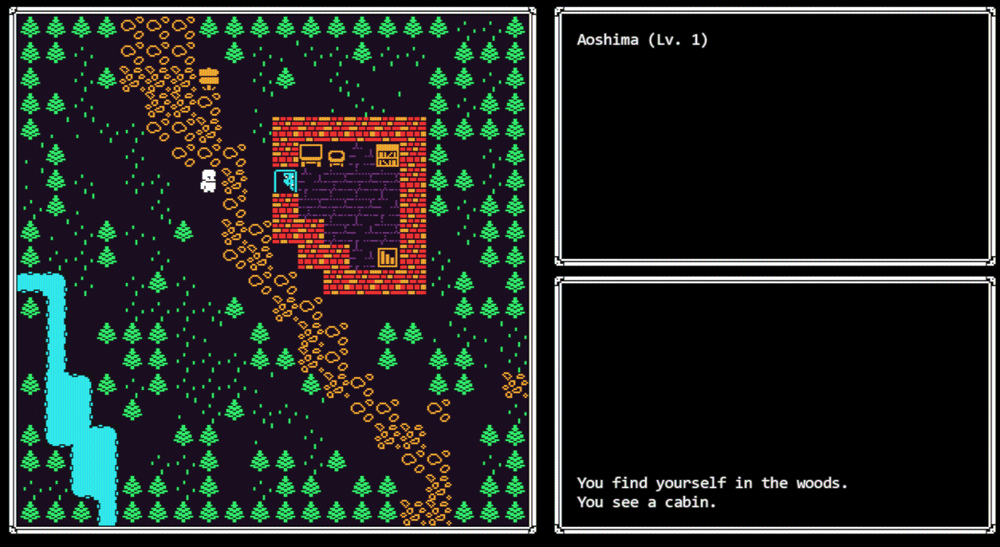

This is a continuous miniblog with small, recent-first texts regarding nothing and everything.  
It's just a way I have of writing without worrying about having a full blog post with references and, like, content.

---

### 2023.12.12

Things haven't been going as planned; as usual. Even though I have been spending some time developing my project, my health has been taking some hits. I'm dropping the depression meds I've been taking for 4-5 years. It sucks ass. One of them is already gone, but the second one is really messing with my body.  
I'm not doing this out of the blue; I haven't been happy with both my meds and my doctor for quite some time now. This is not the first medication I drop either: I stopped taking Zolpidem because I used it as an addiction for years, even though you're suppose to take it for 4 weeks max. It started to help my insomnia (that was long gone already) but I kept taking them to sleep each and every night, until I decided to stop because it was deeply messing me up. It wasn't the first or second try that did it, but I'm free of it for a good year now. I want to do the the same for the other meds I take.  
I really hope I'm not messing things up here.

On the developing side, I pivoted my management sim to a roguelike. What I got excited about, really, was changing the scope of the game and still use the library I developed up until now. Usually I did this every couple of months apart, which rendered the library completely unknown to me and usually meant I'd build it up again and just reuse some code. This time I'm being able to improve the workflow and the way I think things independently of genre or trope. If I happen to pivot to another thing again (this is really plausible) I'll be excited to improve it a little further.

Here's a little screenshot of the current state of the project:

This is the first time I'm messing with high-contrast, 1-bit pixel art. I got the inspiration both from [Moonring](https://store.steampowered.com/app/2373630/Moonring/){:target="_blank"} and [Kenney's 1-bit Pack](https://kenney.nl/assets/1-bit-pack){:target="_blank"}; you can actually see some of his furniture art being used on the screenshot.

This is it for today. I'm off to do some writing and hopefully have some notion of where to go from here.  
Keep trying.